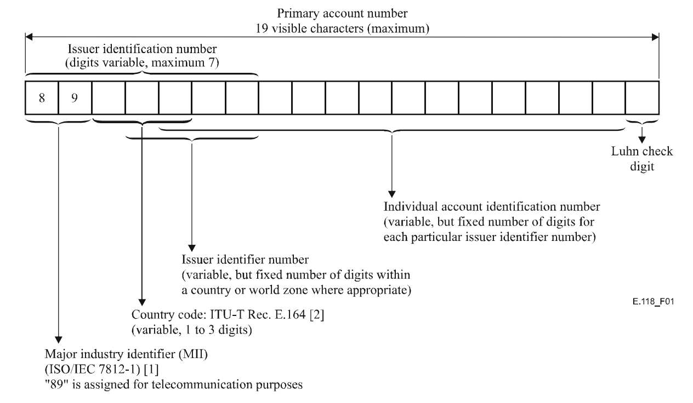

# e118-iin-list [](https://www.npmjs.com/package/e118-iin-list)

[](https://github.com/NordicSemiconductor/e118-iin-list-js/actions)
[](https://github.com/semantic-release/semantic-release)
[](https://github.com/conventional-changelog/commitlint/tree/master/@commitlint/config-conventional)
[](https://github.com/prettier/prettier/)
[](https://github.com/typescript-eslint/typescript-eslint)

List of issuer identification numbers for the international telecommunication
charge card
([ITU-T E.118](https://www.itu.int/rec/dologin_pub.asp?lang=e&id=T-REC-E.118-200605-I!!PDF-E&type=items)).

> **Note**  
> Up-to-date with
> [Operational Bulletin No. 1270 (15.VI.2023)](https://www.itu.int/pub/T-SP-OB.1270-2023)
> and also includes
> [E.164 shared country code entries](http://www.itu.int/net/itu-t/inrdb/e164_intlsharedcc.aspx?cc=881,882,883)
> (which has some overlapping entries).

Data source as
[Google Spreadsheet](https://docs.google.com/spreadsheets/d/1ErJzksU5bF2YA8tQQ9QJleEZHsdvDRDk0Rvi0nf3fh4/edit?usp=sharing).

> _Note:_ There is actually
> [a database](https://www.itu.int/net/itu-t/inrdb/secured/e118iin.aspx) for
> this information, but the access is restricted to ITU-T Sector Members. 🤷

## Motivation

Since E.118's issuer identification number is of variable length (it can be 4–7
digits) an [ICCID](https://en.wikipedia.org/wiki/E.118#ICCID) (the serial number
of SIM cards) needs to be matched against a list of known IINs in order to
determine the SIM issuer.

## Usage

    npm install e118-iin-list

```typescript
import { identifyIssuer } from "e118-iin-list";

const issuer = identifyIssuer("89450421180216254864");
if (issuer !== undefined) {
  console.log(issuer.companyName); // Telia Sonera A/S
}
```

### CLI

You can identify issuers directly from your command line:

    $ npx e118-iin-list 89450421180216254864
    {
      "iin": 894504,
      "countryCode": 45,
      "issuerIdentifierNumber": "04",
      "countryName": "Denmark",
      "companyName": "Telia Sonera A/S"
    }

> _Note:_ if your ICCID is not recognized, please open a new issue
> [in this repository](https://github.com/NordicSemiconductor/e118-iin-list-js/issues/new).

## ITU-T Recommendation E.118 Card numbering structure ([Source](https://www.itu.int/rec/dologin_pub.asp?lang=e&id=T-REC-E.118-200605-I!!PDF-E&type=items))

The numbering of the card to be issued by OAs shall be as follows based on
ISO/IEC 7812-1 (Identification cards – Identification of issuers – Part 1:
Numbering system) and ISO/IEC 7812-2 (Identification cards – Identification of
issuers – Part 2: Application and registration procedures).



The maximum length of the visible card number (primary account number) shall be
19 characters and is composed of the following subparts (see Figure 1):

- Major Industry Identifier (MII);
- country code;
- issuer identifier;
- individual account identification number;
- parity check digit computed according to the Luhn formula (see ISO/IEC 7812-1,
  Annex B). In addition to the parity check digit, OAs may incorporate a
  validation check device in some location on the card which could be changed
  when new cards are issued.

### Notes

- the Major Industry Identifier (MII) is always `89` (_telecommunication
  purposes_)
- the Country Code is a positive integer (no leading zeros)
- the Issuer Identifier (IIN) is a _string_ (it has leading zeros) and can be
  entirely made up of `0`

## Generating the list

Sources:

- http://www.itu.int/pub/T-SP-E.118
- https://www.itu.int/pub/T-SP-OB
- http://www.itu.int/net/itu-t/inrdb/e164_intlsharedcc.aspx?cc=881,882,883

Process:

1. Download the latest Word Documents from http://www.itu.int/pub/T-SP-E.118,
   and copy and past the table into a Google Spreadsheet
2. Download the operational bulletins from https://www.itu.int/pub/T-SP-OB and
   incorporate the changes into the spreadsheet
3. Export list of shared country codes (E.164) from
   http://www.itu.int/net/itu-t/inrdb/e164_intlsharedcc.aspx?cc=881,882,883 and
   filter out `CRS` records (inactive), add to the spreadsheet
4. Export that to CSV and store it as `list.csv`
5. Convert to JSON using `npm run convert`
